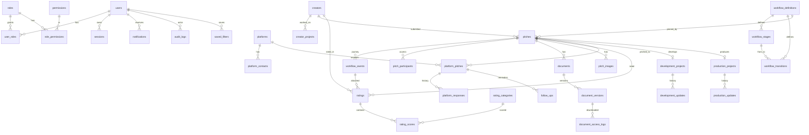
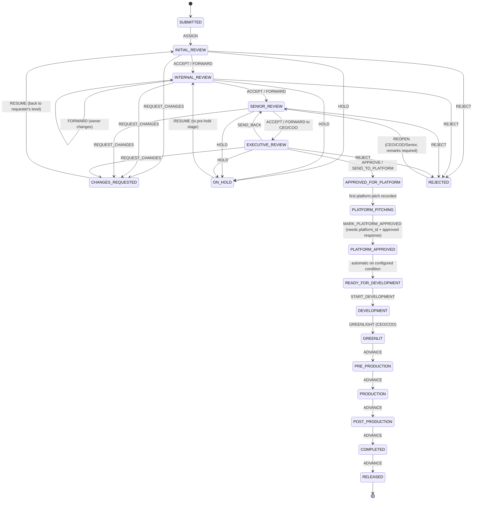

# Story & Pitch Pipeline Control Center — Architecture & Design

Version 0.1 · 15 Sep 2026 · Owner: Durgaji Yedida (Tamada Media)

Principle: **every story has a traceable journey** — WHO → HAS IT → AT WHICH LEVEL → SINCE WHEN → WHAT THEY SAID → WHAT DECISION → WHAT NEXT.

This document covers the "First Task" items (brief §83.1–83.9). Items marked `Assumed:` need confirmation — see §9.

---

## 1. Requirements analysis

### 1.1 What the system fundamentally is
Three things layered on each other:

1. **A case file** per story (pitch): metadata, creator, documents, script versions, images, ratings.
2. **An append-only event log** per story: every assignment, decision, remark, platform response, and stage change. The log is the source of truth; "current status / owner / level / waiting since" are projections of it (business rule 20).
3. **A permission boundary** around both: confidential scripts, creator PII, platform contacts and business decisions — enforced on the server and, for the most sensitive invariants, inside PostgreSQL itself.

### 1.2 Key entities and their lifecycles

| Entity | Lifecycle | Mutability |
|---|---|---|
| Pitch | Workflow stages (configurable) + `ACTIVE/ARCHIVED` | Metadata editable (audited); stage/owner only via workflow engine |
| Workflow event | Created once | **Immutable** (DB trigger) |
| Script / document version | Uploaded → scanned → available / quarantined | **Immutable**; new version = new row; "current" is a pointer |
| Platform pitch | One per (pitch, platform, round) | Status is projection of responses |
| Platform response | Created once | **Immutable** |
| Rating | Created once per (reviewer, pitch, workflow event) | **Immutable**; corrections are new records |
| Audit log | Created once | **Immutable**; app DB role has INSERT only |
| Creator | Created, edited (audited), archived | Deduplicated by normalized mobile/email |

### 1.3 Non-functional requirements (derived)
- **Confidentiality** dominates: scripts are the company's core asset; the most likely real-world breach is an *authorized insider over-downloading*, not an outside hacker. Hence download logging, least-privilege download rights, short-lived links, and anomaly alerts.
- **Integrity** of decisions: a CEO approval or a rejection reason must be provably unaltered.
- **Scale**: 10⁵–10⁶ pitches, 10⁶+ events. Server-side pagination, filtering and search; no full-table loads.
- **Configurability without deploys**: stages, transitions, categories, languages, genres, platforms, thresholds.

---

## 2. System architecture

### 2.1 Style: modular monolith with clean layering
One deployable web app + one background worker, sharing a codebase. A modular monolith is the right size for an internal enterprise tool: one security boundary to review, transactional integrity across workflow + audit, and modules can be split into services later if needed.

```
┌────────────────────────── Browser (React / Next.js client) ──────────────────────────┐
│  UI components only. No authorization decisions. Calls /api/v1 over HTTPS.           │
└───────────────────────────────────────────┬──────────────────────────────────────────┘
                                            │ httpOnly Secure SameSite=Lax session cookie + CSRF token
┌───────────────────────────────────────────▼──────────────────────────────────────────┐
│ Next.js server (Node runtime)                                                        │
│  ┌──────────────┐  ┌─────────────────────────────────────────────────────────────┐   │
│  │ proxy.ts     │  │ Route handlers /api/v1/*  (thin)                            │   │
│  │ headers/CSP  │→ │  1 authenticate  2 rate-limit  3 validate (zod)             │   │
│  │ rate limits  │  │  4 call service  5 map errors → safe responses              │   │
│  └──────────────┘  └───────────────────────────┬─────────────────────────────────┘   │
│                                                │                                     │
│  src/server/modules  (business logic — the only place rules live)                    │
│  ┌──────────┐ ┌──────────┐ ┌───────────┐ ┌───────────┐ ┌──────────┐ ┌─────────────┐  │
│  │ auth     │ │ authz    │ │ workflow  │ │ pitches   │ │ creators │ │ platforms   │  │
│  │ sessions │ │ RBAC +   │ │ engine    │ │ documents │ │ projects │ │ responses   │  │
│  │ MFA      │ │ resource │ │ (data-    │ │ versions  │ │ ratings  │ │ follow-ups  │  │
│  │ lockout  │ │ policies │ │  driven)  │ │ images    │ │ PII mask │ │ dev / prod  │  │
│  └──────────┘ └──────────┘ └───────────┘ └───────────┘ └──────────┘ └─────────────┘  │
│  ┌──────────┐ ┌──────────┐ ┌───────────┐ ┌───────────┐ ┌──────────┐                  │
│  │ audit    │ │ notify   │ │ storage   │ │ search /  │ │ exports  │                  │
│  │ (append) │ │ (outbox) │ │ (S3 port) │ │ analytics │ │ (logged) │                  │
│  └──────────┘ └──────────┘ └───────────┘ └───────────┘ └──────────┘                  │
│  src/server/db  Drizzle ORM (parameterized) — queries per module                     │
└───────────────┬──────────────────────────────┬──────────────────────────┬────────────┘
                │                              │                          │
        ┌───────▼────────┐          ┌──────────▼─────────┐     ┌──────────▼──────────┐
        │ PostgreSQL 16  │          │ Private object     │     │ Worker process      │
        │ constraints,   │          │ storage (S3-compat)│     │ jobs table (outbox):│
        │ immutability   │          │ SSE-KMS, no public │     │ malware scan, file  │
        │ triggers, role │          │ ACLs, quarantine/  │     │ type check, email,  │
        │ grants, PITR   │          │ clean prefixes     │     │ aging alerts,       │
        └────────────────┘          └────────────────────┘     │ follow-up reminders │
                                                               └─────────────────────┘
```

### 2.2 Stack (versions verified on npm registry, 15 Sep 2026)

| Layer | Choice | Version pinned | Why |
|---|---|---|---|
| UI + API | Next.js App Router, React | 16.3.5 / 19.3.0 | Brief §50; server components keep data server-side |
| Language | TypeScript `strict` | 6.0.3 | 7.x is days old; 6.0 is stable with the Next toolchain |
| ORM | Drizzle ORM + drizzle-kit, `pg` driver | 0.45.2 / 0.31.10 / 8.23.0 | Parameterized queries; SQL migrations are plain files you can review. Prisma was evaluated first but its migration engine downloads native binaries at runtime, which failed in the build environment and adds an unreviewed binary to the supply chain |
| Validation | Zod | 4.6.5 | Schema validation at every API boundary; `.strict()` blocks mass assignment |
| Passwords | `@node-rs/argon2` (argon2id) | 2.2.1 | OWASP-recommended hash |
| Tests | Vitest | 5.0.1 | 4.1.11 would not install (npm peer-resolution error); 5.0.1 installed cleanly and all tests pass |
| DB | PostgreSQL | 16 | Brief §42 |

**Authentication choice.** Assumed: company email + password (argon2id) + TOTP MFA, **mandatory MFA for Admin, Super Admin, CEO, COO** — tell me if wrong. Sessions are opaque random tokens stored as HMAC-SHA256 (server-side pepper) in `sessions`; the cookie holds only the raw token. The auth module is behind an interface so Google Workspace SSO (OIDC) can replace passwords later without touching other modules.

### 2.3 Request lifecycle for a protected mutation (e.g. Reject)

1. `src/proxy.ts` + `route()` wrapper: CSP nonce, security headers, per-IP rate limit, body-size cap.
2. `requireSession()` → resolves user from hashed token; rejects expired/revoked/locked.
3. CSRF: double-submit token checked for all non-GET.
4. Zod schema `.strict()` parses body; unknown fields → 400.
5. `workflowService.perform(actor, pitchId, 'REJECT', input)`:
   - Loads pitch **through `pitchAccessPolicy`** — no access → 404 (not 403, to avoid confirming existence).
   - Finds the transition in the pitch's pinned workflow definition for `(currentStage, action)`.
   - Checks permission, role gate, required fields (rejection category + reason), self-approval policy, optimistic lock (`pitch.version`).
   - One DB transaction: insert `workflow_events` row, update pitch projection, insert `audit_logs`, insert notification outbox rows.
6. Response: minimal DTO. Errors mapped to `{ error: { code, message } }`; details only in server logs.

---

## 2a. Multi-tenant architecture (SaaS release)

Shared database, shared schema, row-level isolation. Design and audit: `docs/SAAS_MULTI_TENANT_PLAN.md`.

```
Browser ──> route() / page ──> resolveSession (pitch_platform: sessions, users, companies)
                               │  actor = { userId, companyId, scope, roles, permissions }
                               ├─ scope COMPANY  → withCompany(companyId) → getDb() = TenantPool(pitch_app)
                               │                    every statement: BEGIN; set_config('app.company_id', id, true); …; COMMIT
                               │                    RLS: company_id = app_company_id()  (reads AND writes)
                               └─ scope PLATFORM → getPlatformDb() (pitch_platform) → /platform console
                                                    no privileges on pitches, creators, documents, ratings, events
```

| Concept | Where |
|---|---|
| Company, plan, subscription, subscription events, usage, support grants, email domains/exceptions, platform catalogue, invitations | `companies`, `plans`, `subscriptions`, `subscription_events`, `usage_records`, `support_access_grants`, `company_email_domains`, `company_allowed_emails`, `platform_catalog`, `user_invitations` (migration `0006_multi_tenant.sql`) |
| Tenant context and handles | `src/server/db/client.ts` (`TenantPool`, `getDb`, `withCompany`, `getPlatformDb`) |
| Route scoping | `src/server/lib/http.ts` (`scope: COMPANY | PLATFORM | ANY`), `src/server/lib/page-session.ts` |
| Provisioning (defaults per company) | `src/server/modules/tenancy/provision.ts` |
| Invitations + email policy | `src/server/modules/tenancy/invitations.ts` |
| Plan limits | `src/server/modules/tenancy/limits.ts` |
| Company profile/branding/exceptions | `src/server/modules/tenancy/company.ts`, page `/company` |
| Super Admin (companies, status, subscriptions, plans, domains, support access, platform audit) | `src/server/modules/platform/service.ts`, pages `/platform/*`, API `/api/v1/platform/*` |
| Roles | Platform: `users.scope = PLATFORM` (no company, no company roles). Company: `COMPANY_ADMIN` (all company permissions, incl. `company.manage`), `ADMIN`, `CEO`, `COO`, `SENIOR_EMPLOYEE`, `EMPLOYEE`, `VIEWER` — per company, editable |
| Codes | Pitch codes per company: `<prefix>-<year>-<n>` (prefix defaults to company code; TAM keeps `PT`) |
| Storage keys | `company/<company_id>/pitches/<pitch_id>/documents/<version_id>.<ext>` etc. |
| Jobs | `/api/cron/run` loops companies; identity clean-up and subscription expiry on the platform role |

## 3. Database schema / ER diagram

Full definition: `src/server/db/schema.ts` → generated `drizzle/0000_init.sql`, plus hand-written `drizzle/0001_integrity.sql` for triggers and grants. Conventions: UUID v4 primary keys (non-sequential), `created_at`/`updated_at` everywhere, `archived_at` for soft deletion, human-readable `pitch_code` (`PT-2026-000123`) for display only — never used for authorization.



### 3.1 Tables (grouped)

**Identity & access** — `users` (email unique, `password_hash`, `mfa_secret_enc`, `failed_login_count`, `locked_until`, `status`), `sessions` (`token_hash` unique, `expires_at`, `revoked_at`, `ip`, `user_agent`), `password_reset_tokens` (hashed, single use, 30 min), `roles`, `permissions`, `role_permissions`, `user_roles`.

**Configuration** — `lookup_values` (type ∈ GENRE, SUB_GENRE, LANGUAGE, FORMAT, REJECTION_CATEGORY, CHANGE_REQUEST_TYPE, DOCUMENT_CATEGORY, IMAGE_CATEGORY, BUDGET_RANGE; `key`, `label`, `sort_order`, `active`), `rating_categories`, `system_settings` (typed JSON: aging thresholds, ratings visibility, self-approval policy, CEO/COO approval mode, file limits).

**Workflow** — `workflow_definitions` (versioned; `is_active`), `workflow_stages` (`key`, `name`, `category` ∈ INTAKE/REVIEW/EXECUTIVE/PLATFORM/DEVELOPMENT/PRODUCTION/TERMINAL, `is_terminal`, `badge`), `workflow_transitions` (`from_stage_id`, `to_stage_id`, `action` ∈ ASSIGN/FORWARD/ACCEPT/REJECT/REQUEST_CHANGES/HOLD/RESUME/APPROVE/SEND_TO_PLATFORM/SEND_BACK/MARK_PLATFORM_APPROVED/START_DEVELOPMENT/GREENLIGHT/ADVANCE/REOPEN, `required_permission`, `allowed_role_keys[]`, `requires_remarks`, `requires_rejection_reason`, `requires_recipient`, `requires_change_types`, `recipient_role_keys[]`).

**Pitch** — `pitches` (content fields from §4 of brief; `creator_id` FK; `confidentiality` ∈ STANDARD/CONFIDENTIAL/RESTRICTED; **projection columns** `current_stage_id`, `current_owner_id`, `stage_entered_at`, `last_event_id`, `version` for optimistic locking; `created_by_id`; `archived_at`), `pitch_tags`, `pitch_participants` (user ↔ pitch with reason: CREATED/ASSIGNED/REVIEWED/PLATFORM_OWNER/DEV_OWNER/PROD_OWNER/GRANTED — drives need-to-know access), `workflow_events` (**append-only**: `pitch_id`, `seq` unique per pitch, `action`, `from_stage_id`, `to_stage_id`, `actor_id`, `from_owner_id`, `to_owner_id`, `decision`, `remarks`, `recommendation`, `rejection_category_key`, `rejection_reason`, `change_types[]`, `approval_type`, `recommended_platform_ids[]`, `platform_id`, `metadata` JSON, `created_at`).

**Documents** — `documents` (logical: pitch, category, title, `current_version_id`), `document_versions` (**append-only**: `version_no` unique per document, `storage_key`, `original_filename` (display only, sanitized), `detected_mime`, `size_bytes`, `sha256`, `scan_status` ∈ PENDING/CLEAN/INFECTED/FAILED, `version_status`, `notes`, `uploaded_by_id`), `pitch_images` (same storage pattern), `document_access_logs` (**append-only**: who, version, action VIEW/DOWNLOAD, ip, user agent, at).

**Creators** — `creators` (`creator_type`, `full_name`, `mobile_e164` unique-when-present, `email_normalized` unique-when-present, `profile_image_key`, location, languages, experience, bio, agency, links JSON, `consent_basis`, `consent_recorded_at`, `archived_at`), `creator_projects` (role, company, platform, year, language, genre, status, poster key, description, links).

**Ratings** — `ratings` (**append-only**: `creator_id`, `pitch_id`, `reviewer_id`, `workflow_event_id` nullable, `overall` 1–5, `comments`), `rating_scores` (`rating_id`, `category_id`, `score` 1–5 CHECK).

**Platforms** — `platforms` (`name` unique, languages, genres, preferences, notes, `active`), `platform_contacts`, `platform_pitches` (`pitch_id`, `platform_id`, `round_no`, `pitched_by_id`, `contact_id`, `pitch_date`, `method`, `materials_sent` JSON, `script_version_id`, `deck_version_id`, `remarks`, projection `current_status`, `next_follow_up_on`), `platform_responses` (**append-only**: status, notes, `recorded_by_id`, `response_date`), `follow_ups` (due date, assignee, `completed_at`, outcome).

**Development / Production** — `development_projects` (owner, dates, stage, notes), `development_updates` (append-only), `production_projects` (owner, company, dates, budget in paise `BIGINT`, platform, status), `production_updates` (append-only).

**Operational** — `notifications` (user, type, title, `pitch_id`, `read_at`), `job_outbox` (type, payload, `run_after`, attempts, status), `audit_logs` (**append-only**: actor, action, resource_type, resource_id, ip, user_agent, `before` JSON, `after` JSON — PII-redacted, `request_id`), `saved_filters` (user, name, query JSON validated against filter schema).

### 3.2 Integrity enforced inside PostgreSQL (not only in app code)

| Invariant | Mechanism |
|---|---|
| Workflow events, platform responses, ratings, document versions, audit logs, access logs cannot be edited/deleted | `BEFORE UPDATE OR DELETE` trigger raising exception **and** app role granted `SELECT, INSERT` only |
| Rejection event must carry category + reason (≥ 10 chars) | `CHECK` constraint on `workflow_events` |
| Rating scores 1–5 | `CHECK` |
| One current version per document; version numbers unique | unique `(document_id, version_no)` + FK |
| Creator dedupe | partial unique indexes on `mobile_e164`, `email_normalized` where not null |
| Event order | unique `(pitch_id, seq)` |
| Pitch hard delete impossible for app | app role lacks `DELETE` on `pitches`; archive only |

Two DB roles: `pitch_migrator` (DDL, used only by CI migrations) and `pitch_app` (DML with the restricted grants above). A compromised app server therefore cannot rewrite history.

### 3.3 Indexes (initial)
`pitches(current_stage_id, stage_entered_at)`, `pitches(current_owner_id)`, `pitches(creator_id)`, `pitches(language_key, genre_key, format_key)`, `pitches(created_at)`, trigram GIN on `pitches.title`, `creators.full_name`; `workflow_events(pitch_id, seq)`, `workflow_events(actor_id, created_at)`; `platform_pitches(platform_id, current_status)`, `follow_ups(due_on) WHERE completed_at IS NULL`; `notifications(user_id, read_at, created_at)`; `audit_logs(resource_type, resource_id, created_at)`.

---

## 4. RBAC model

### 4.1 Three layers — all must pass
1. **Role → permission** (coarse): may this user perform this *kind* of action?
2. **Resource policy** (fine): may this user touch *this* pitch/creator/document? (need-to-know + confidentiality)
3. **Workflow rule**: is this action valid *now*, from this stage, by this actor?

### 4.2 Permissions (catalogue)
`pitch.create, pitch.view, pitch.view_all, pitch.edit, pitch.forward, pitch.accept, pitch.reject, pitch.request_changes, pitch.hold, pitch.approve_executive, pitch.send_to_platform, pitch.reopen, pitch.archive, pitch.restore` · `document.upload, document.download, document.view_meta` · `creator.view, creator.view_pii, creator.create, creator.edit, creator.archive` · `rating.view, rating.add` · `platform.view, platform.manage, platform.pitch, platform.record_response` · `development.manage, production.manage` · `analytics.view, report.view, data.export` · `user.manage, role.manage, workflow.manage, config.manage, audit.view`

### 4.3 Default role matrix (admin-editable, except Super Admin)

| Permission group | Super Admin | Admin | Senior Emp. | Employee | CEO | COO | Viewer |
|---|---|---|---|---|---|---|---|
| pitch.create / edit | ✓ | – | ✓ | ✓ | ✓ | ✓ | – |
| pitch.view (need-to-know) | ✓ | – | ✓ | ✓ | ✓ | ✓ | ✓ |
| pitch.view_all | ✓ | – | ✓ | – | ✓ | ✓ | – |
| pitch.reopen | ✓ | – | ✓ | – | ✓ | ✓ | – |
| forward / accept / reject / request_changes / hold | ✓ | – | ✓ | ✓ | ✓ | ✓ | – |
| approve_executive / send_to_platform | ✓ | – | – | – | ✓ | ✓ | – |
| document.upload | ✓ | – | ✓ | ✓ | ✓ | ✓ | – |
| document.download | ✓ | – | ✓ | ✓ (need-to-know) | ✓ | ✓ | – |
| creator.view / create / edit | ✓ | ✓ | ✓ | ✓ / ✓ / – | ✓ | ✓ | view |
| creator.view_pii | ✓ | ✓ | ✓ | – (masked) | ✓ | ✓ | – |
| rating.add / view | ✓ | – | ✓ | ✓ | ✓ | ✓ | per setting |
| platform.manage | ✓ | ✓ | – | – | – | – | – |
| platform.pitch / record_response | ✓ | – | ✓ | ✓ (only as current owner) | ✓ | ✓ | – |
| development / production.manage | ✓ | – | ✓ | – | ✓ | ✓ | – |
| analytics / reports | ✓ | ✓ | ✓ | – | ✓ | ✓ | ✓ |
| data.export | ✓ | – | – | – | ✓ | ✓ | – |
| user / role / workflow / config.manage | ✓ | ✓ (not Super Admin, not own roles) | – | – | – | – | – |
| audit.view | ✓ | ✓ | – | – | – | – | – |

Deliberate choice: **Admin manages the system but cannot read scripts** (separation of duties). `Assumed:` — tell me if wrong.

### 4.4 Resource policy for pitches
A user can see pitch P iff not archived (or has `pitch.restore`) **and** one of:
- has `pitch.view_all` and clearance ≥ P.confidentiality, or
- is P's current owner, or
- has a `pitch_participants` row for P (created, reviewed, was assigned, owns platform/dev/prod work).

`RESTRICTED` pitches: only explicit participants + CEO/COO/Super Admin. The same policy compiles to a SQL `WHERE` condition (`pitchVisibilityCondition`), so lists, search, Kanban, analytics and exports are filtered identically — there is no second code path to forget. Access failure returns **404**.

### 4.5 Hard rules
- Users cannot change their own roles; Admin cannot grant/revoke Super Admin; last Super Admin cannot be removed.
- Self-approval: an actor who created the pitch or already approved it at an earlier level cannot `APPROVE`/`SEND_TO_PLATFORM` unless `system_settings.allow_self_approval = true` (default false).
- PII masking is done in the DTO mapper on the server (`+91 XXXXX 12345`); unmasked fields never leave the server for users without `creator.view_pii`.

---

## 5. Workflow state machine

### 5.1 Default definition (seeded as data, editable by Admin as a *new version*)



(Diagram simplified: `ON_HOLD`/`CHANGES_REQUESTED` return to the stage stored in the hold/request event, not a fixed stage.)

### 5.2 Engine contract
```
perform(actor, pitchId, action, input, expectedVersion) → WorkflowEvent
```
Checks, in order, each producing a distinct error code:
1. `PITCH_NOT_FOUND` — pitch invisible to actor (policy).
2. `STALE_VERSION` — someone acted since the actor loaded the page.
3. `TRANSITION_NOT_ALLOWED` — no transition `(currentStage, action[, target])` in the pitch's pinned definition. FORWARD can target the same or any higher level, so the caller names the target level.
4. `FORBIDDEN` — missing permission or role not in `allowed_role_keys`.
5. `NOT_CURRENT_OWNER` — review actions require actor = current owner (or `pitch.view_all` + override permission, logged).
6. `VALIDATION` — required remarks / rejection category+reason / recipient / change types.
7. `INVALID_RECIPIENT` — recipient inactive, lacks role, or cannot be given access to a RESTRICTED pitch.
8. `SELF_APPROVAL_BLOCKED`.
Then a single transaction: event insert (seq = last+1), projection update with `WHERE version = expected`, participant upsert for recipient, audit, outbox notifications.

The Kanban board calls the **same** endpoint; a drag is just a proposed action, and the UI only offers drops the engine's `availableActions(actor, pitch)` returns.

In-flight pitches stay pinned to the definition version they started on; Admin changes create a new version; a migration tool maps stages when Admin explicitly chooses to move in-flight pitches.

### 5.3 Projection & reconciliation (rule 20)
`pitches.current_stage_key / current_owner_id / stage_entered_at` are rebuilt deterministically by folding `workflow_events` in `seq` order. A nightly job and a test assert `fold(events) == projection` for every pitch; drift raises a security alert.

---

## 6. API structure (`/api/v1`, JSON, cursor pagination)

| Area | Endpoints |
|---|---|
| Auth | `POST auth/login`, `POST auth/logout`, `POST auth/mfa/verify`, `POST auth/mfa/enroll`, `POST auth/password/forgot`, `POST auth/password/reset`, `GET auth/me` |
| Pitches | `GET pitches?cursor&limit&filters…`, `POST pitches`, `GET pitches/:id`, `PATCH pitches/:id`, `POST pitches/:id/archive`, `POST pitches/:id/restore`, `GET pitches/:id/status` (the "Where is it now?" block) |
| Workflow | `GET pitches/:id/actions` (available actions for me), `POST pitches/:id/actions` `{action, expectedVersion, …}`, `GET pitches/:id/timeline` |
| Documents | `POST pitches/:id/documents/upload-intent`, `POST documents/:docId/versions/upload-intent`, `POST uploads/:uploadId/complete`, `GET pitches/:id/documents`, `GET document-versions/:id/download` (→ 302 to 60-second signed URL, logged), `GET document-versions/:id/access-log` |
| Images | `POST pitches/:id/images/upload-intent`, `GET pitches/:id/images` (thumbnails via signed URLs) |
| Creators | `GET creators?q=`, `POST creators/match` (dedupe check by name/mobile/email), `POST creators`, `GET creators/:id`, `PATCH creators/:id`, `GET creators/:id/stats`, `GET creators/:id/pitches`, `POST creators/:id/projects`, `PATCH creator-projects/:id` |
| Ratings | `POST pitches/:id/ratings`, `GET creators/:id/ratings` (visibility-gated) |
| Platforms | `GET/POST platforms`, `PATCH platforms/:id`, `POST platforms/:id/contacts`, `PATCH platform-contacts/:id`, `POST pitches/:id/platform-pitches`, `POST platform-pitches/:id/responses`, `POST platform-pitches/:id/follow-ups`, `PATCH follow-ups/:id/complete` |
| Dev / Prod | `POST pitches/:id/development`, `POST development/:id/updates`, `POST pitches/:id/production`, `POST production/:id/updates` |
| Dashboard / analytics | `GET dashboard/summary`, `GET dashboard/me`, `GET analytics/funnel`, `GET analytics/{by-month,by-genre,by-language,by-platform,review-times,aging}` |
| Search | `GET search?q=` (grouped results, policy-filtered, min 3 chars, rate-limited) |
| Reports / exports | `GET reports/{pitch,creator,platform,employee,pipeline}`, `POST exports` → job → `GET exports/:id/download` |
| Notifications | `GET notifications`, `POST notifications/:id/read`, `POST notifications/read-all` |
| Saved filters | `GET/POST/DELETE saved-filters` |
| Admin | `GET/POST/PATCH users`, `POST users/:id/roles`, `GET/POST/PATCH roles`, `GET/POST workflow-definitions` (new version), `GET/POST/PATCH lookups/:type`, `GET/PATCH settings`, `GET audit-logs` |

Error shape: `{ "error": { "code": "VALIDATION", "message": "Rejection reason is required.", "fields": {…} } }`. 500s return only `"Something went wrong. Please try again."` plus a `requestId`.

---

## 7. Cloud architecture

**Chosen deployment (Sep 2026): Vercel (`bom1` Mumbai) + Supabase (`ap-south-1` Mumbai)** — PostgreSQL 17 and a private Storage bucket. Steps and current state: `docs/DEPLOYMENT.md`.

- The app talks to Supabase only from the server: PostgreSQL as the least-privilege `pitch_app` role through the pooler with certificate verification, and Storage REST with a server-only secret key. The Data API is locked out (all grants to `anon`/`authenticated`/`service_role` revoked, RLS on every table with a `pitch_app`-only policy).
- Background work runs as a daily Vercel Cron call to `/api/cron/run`; there is no persistent worker, which is why malware scanning is not yet built (it needs an external scanning service or a small worker).
- Uploads go browser → one-time signed URL → quarantine key; the server validates content before moving the object to its final key.

The original AWS reference design below remains a valid path if the organisation later needs a private network, a scanning worker, or AWS-native backups.

`Assumed:` hosting in an India region for data-residency and latency — tell me if wrong. Recommended reference deployment (AWS `ap-south-1` Mumbai); equivalents on GCP/Azure work the same way.

```
Users ──HTTPS──► CloudFront + AWS WAF (managed OWASP rules, rate rules, geo policy)
                    │
                    ▼
            ALB (TLS 1.2+, HSTS) ──► ECS Fargate: web (≥2 tasks, private subnets)
                                     ECS Fargate: worker (ClamAV sidecar)
                    │                          │
       ┌────────────┴───────┐        ┌─────────┴─────────┐
       ▼                    ▼        ▼                   ▼
 RDS PostgreSQL 16     S3 private bucket          SES (email, no script content)
 Multi-AZ, KMS,        Block Public Access,
 PITR 35 d, private    SSE-KMS, versioning,
 subnet, IAM auth      object lock on audit exports
       │
 Secrets Manager (DB creds, session pepper, SMTP) · CloudWatch + Sentry (PII-scrubbed)
 GuardDuty · CloudTrail · AWS Backup (cross-region copy to ap-south-2 Hyderabad)
```

Environments: **dev** (local Docker Postgres + MinIO, synthetic seed), **staging** (separate AWS account, synthetic data, same IaC), **production** (separate account, no seed demo data, deploy only from protected `main` via CI with OIDC — no long-lived cloud keys).

Why not Vercel-only: the malware-scan worker and long-running jobs need a persistent process, and keeping app, DB and storage inside one private network is simpler to secure. A Vercel front-end + managed Postgres (e.g. Supabase in Mumbai) + S3 is a valid alternative if you prefer it.

---

## 8. Security risk register (top risks, ranked by damage)

| # | Risk | Attack path | Control |
|---|---|---|---|
| 1 | **Insider script exfiltration** | Authorized employee bulk-downloads scripts | Need-to-know download rights, per-download audit, 60 s signed URLs with `Content-Disposition: attachment`, download-rate anomaly alerts, optional visible watermark (future) |
| 2 | **IDOR / BOLA** | Change `pitchId`, `documentVersionId`, `creatorId` | Single resource-policy layer used for reads and writes, UUIDs, 404 on deny, integration tests per endpoint with a second user |
| 3 | **Workflow bypass** | Call action API from wrong stage / Kanban drag / replay | Engine validates transition + owner + version; DB CHECK on rejection; events immutable |
| 4 | **Account takeover** | Credential stuffing, phishing CEO | argon2id, lockout + IP rate limit, mandatory MFA for execs/admins, session rotation on login, 12 h absolute / 30 min idle |
| 5 | **Privilege escalation** | Admin grants self CEO; mass assignment `role` in PATCH | `.strict()` schemas, role changes via dedicated endpoint, cannot edit own roles, audited |
| 6 | **Malicious upload** | Macro DOCX, polyglot PDF, SVG with script, zip bomb | Allowlist extensions + magic-byte check, size caps, no SVG, ClamAV in quarantine prefix, never render uploads inline on app origin |
| 7 | **Stored XSS** | Script in remarks/synopsis/filename | React escaping, no `dangerouslySetInnerHTML`, strict CSP with nonces, filenames sanitized |
| 8 | **CSV/Excel formula injection** | Creator name `=HYPERLINK(…)` in export | Prefix cells starting with `= + - @ \t \r` with `'` |
| 9 | **PII over-exposure** | Search by mobile number enumerates creators; exports | `creator.view_pii` gate, server-side masking, search min length + rate limit, export permission + audit |
| 10 | **Audit/history tampering** | Compromised app edits events | DB triggers + INSERT-only grants; periodic hash-chain checkpoint (Phase 9) |
| 11 | **Secret leakage** | `NEXT_PUBLIC_` misuse, logs, git | No secrets with public prefix (CI check), gitleaks in CI, log redaction |
| 12 | **SSRF** | Website/social link fields fetched server-side | Links are stored and displayed only, never fetched by server; `rel="noopener noreferrer"` |
| 13 | **CSRF** | Cross-site form posts with session cookie | SameSite=Lax + double-submit token on mutations + Origin check |
| 14 | **Backup exposure** | Snapshot shared / exported | KMS-encrypted, separate backup account, no public snapshots |
| 15 | **Supply chain** | Malicious npm update | Exact pinned versions, lockfile, `npm audit`/Dependabot, review install scripts |
| 16 | **Future AI features** | Prompt injection via uploaded script | AI output advisory only, no tool privileges, human decision required (brief §79) |

---

## 9. Ambiguous business rules — decisions needed

Each has a default already built in so work is not blocked.

1. **Do creators log in?** `Assumed:` no — employees enter pitches on creators' behalf; no external portal in v1 — tell me if wrong.
2. **Are "Employee A/B/C" fixed people or levels?** `Assumed:` levels (Initial → Internal → Senior), any number of forwards within a level; the forwarder picks the person — tell me if wrong.
3. **CEO and COO: either one, or both required?** `Assumed:` either one (setting `executive_approval_mode = ANY`, switchable to `ALL`) — tell me if wrong.
4. **Employee "Accept"**: final or a recommendation? `Assumed:` recommendation that must name the next reviewer (brief §14); only CEO/COO give final approval — tell me if wrong.
5. **Multiple platforms at once and exclusivity.** `Assumed:` a pitch may be pitched to several platforms in parallel; the first `Approved` response (recorded by an authorized user) moves the pitch to Ready for Development; other open platform pitches are flagged for a decision, not auto-closed — tell me if wrong.
6. **Can a rejected pitch be reopened?** `Assumed:` yes, by Senior/CEO/COO with mandatory remarks, as a new event — tell me if wrong.
7. **Who greenlights?** `Assumed:` CEO or COO records it, referencing the approving platform — tell me if wrong.
8. **Does Hold / Changes Requested pause the aging clock?** `Assumed:` aging continues but is reported separately as "On hold" — tell me if wrong.
9. **Who may download scripts?** `Assumed:` current owner, prior reviewers of that pitch, Senior, CEO, COO; Admin cannot — tell me if wrong.
10. **Ratings**: `Assumed:` visible to Senior/CEO/COO by default; each reviewer may add one rating per review event — tell me if wrong.
11. **Data retention** for rejected pitches and creator personal data (India DPDP Act, 2023). `Unknown:` retention periods — resolve with your legal counsel / CA; the system stores a configurable retention policy per record type.
12. **Authentication**: `Assumed:` email + password + MFA. If Tamada Media uses Google Workspace, Google SSO would be simpler and stronger — tell me if wrong.
13. **Hosting & budget**: `Assumed:` AWS Mumbai — see §7.
14. **Budget currency**: `Assumed:` INR, stored as integer paise; ranges configurable — tell me if wrong.
